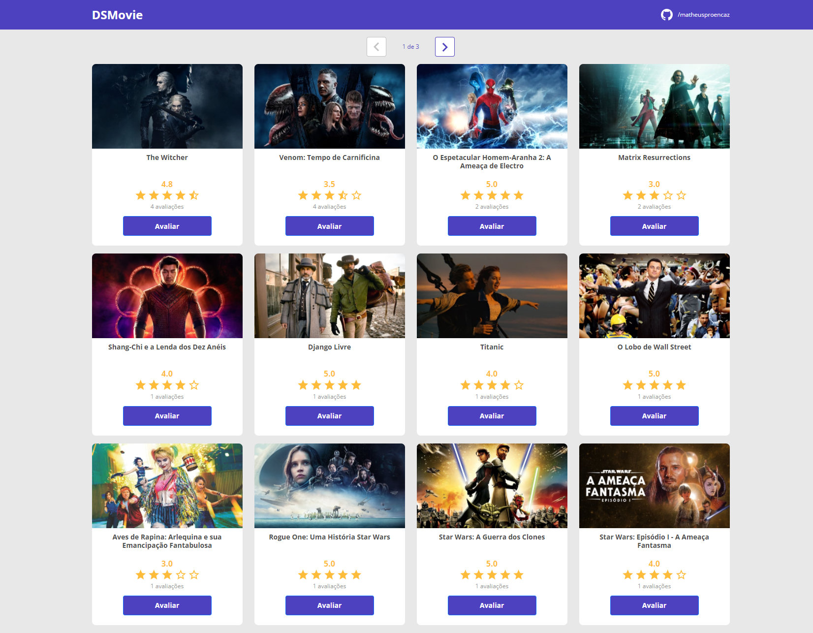
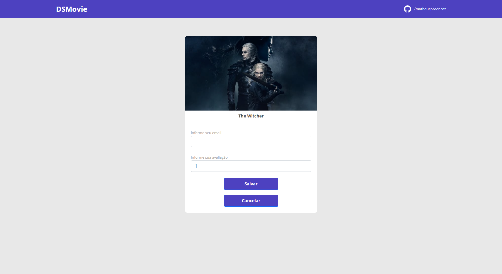
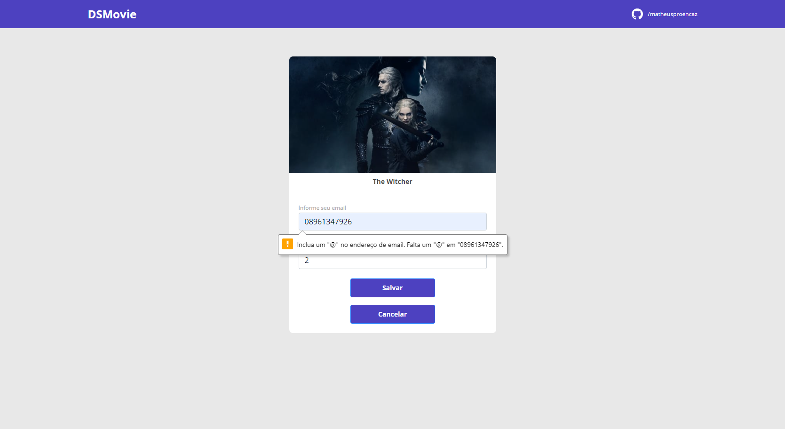

## WorkShop FULLSTACK - DSMOVIE
### Professor: Nelio Alves
### JAVA SpringBoot no Back-End, com React para Front-End.

- Projeto consiste em uma aplicação Web de avaliação por notas para filmes, com paginação direta do back-end.

### Focos:
- Criação de uma REST API para aplicação.
- Consumo da API em um Front-End.
- Utilização de um banco de dados relacional.
- Ensinar a como dar deploy nas aplicações com os sites Heroku e Netlify.

  Você pode acessar a aplicação no Netlify 
  <a href="https://workshop-dsmovie.netlify.app/">aqui</a>!

### Imagens do Projeto:

  
  
  

